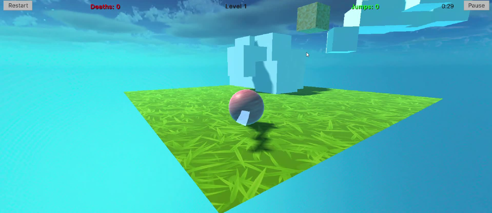
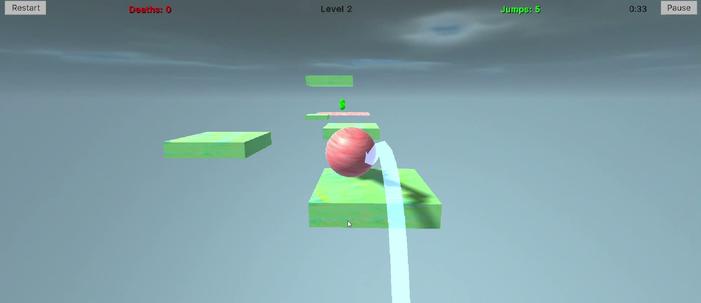
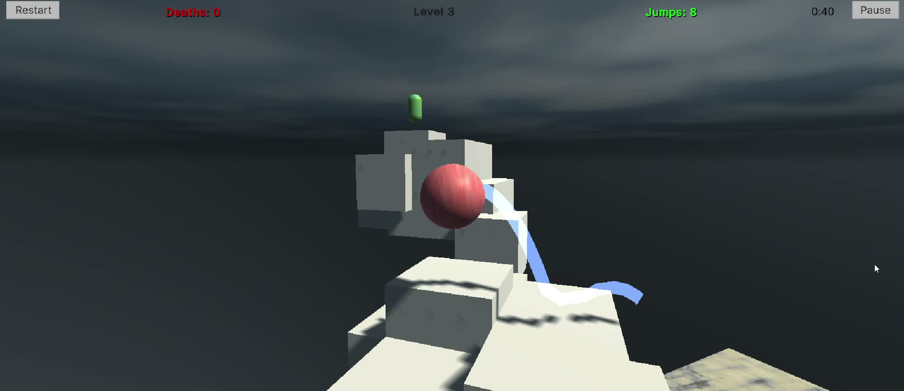
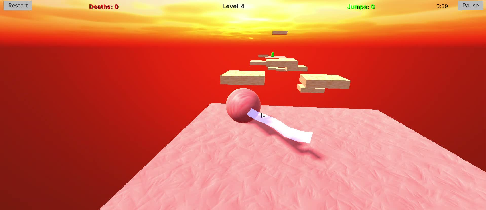
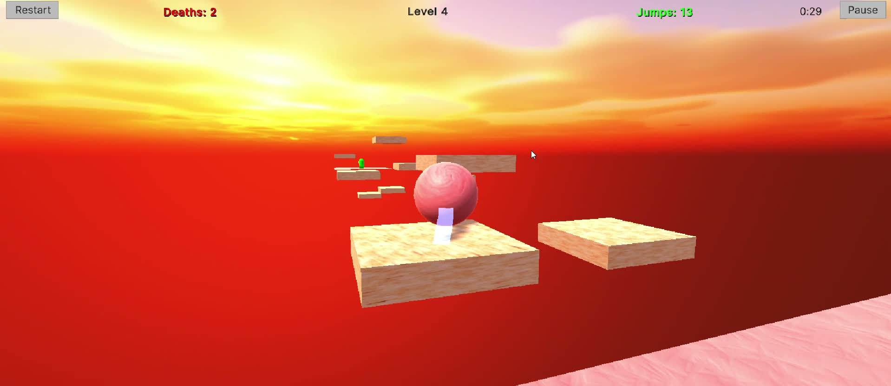
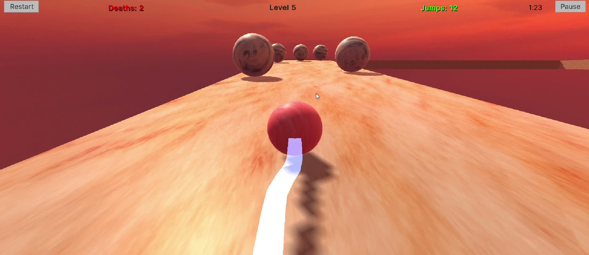
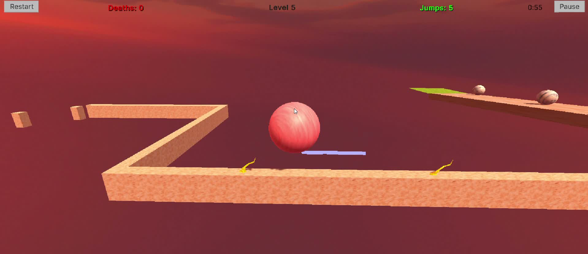
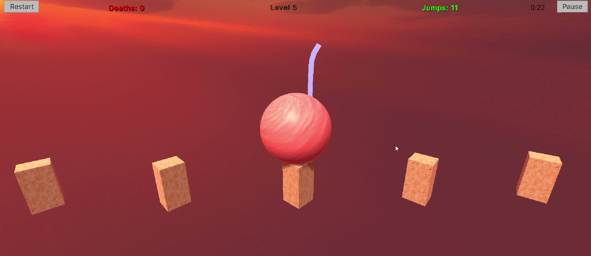
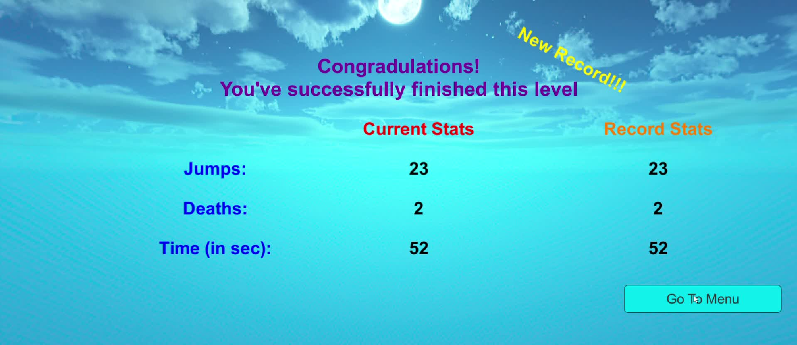

# Jump-or-die

A 3D ball platformer built in Unity. Roll and jump across floating courses, reach the finish before time runs out, and improve your best time, jump count, and death count across five levels.

## Gameplay

- **Five levels** unlock as you progress, each with its own time limit.
- **Changing obstacles** include moving and disappearing platforms, spikes, rolling hazards, and platforms that appear when touched.
- **Run statistics** track jumps, deaths, and time; the finish screen compares them with your best results for the level.
- **Camera and sound** include a follow camera with rotation and zoom, jump sounds, background music, and a pause menu.

## Controls

| Action           | Control                                    |
| ---------------- | ------------------------------------------ |
| Move             | WASD or arrow keys                         |
| Jump             | Space                                      |
| Rotate camera    | Hold right mouse button and move the mouse |
| Zoom             | Mouse wheel                                |
| Pause or restart | On-screen buttons                          |

## Built with

Unity and C#. The scripts handle Rigidbody-based ball movement, camera-relative controls, level selection, obstacles, UI, sound, and run records.

## Running the game

Open the **full Unity project** in a compatible Unity Editor version and play the Start scene. The scenes, prefabs, materials, audio, and other assets are in the repository.

> Level unlocks and records are kept in memory by `GameManager`; they reset when the game application closes.

## Gameplay Previews

[Watch Gameplay Video](https://drive.google.com/file/d/1D_0W4Z6e-pJSCE1W64U3XJELBZjO-cpa/view?usp=sharing)
